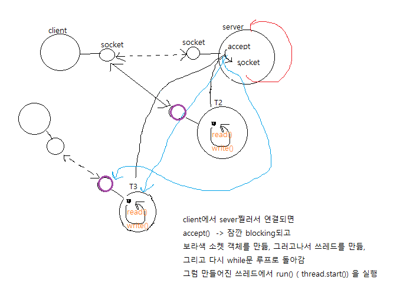

**EchoServer.java**에 Thread



---

1 - accept되면 쓰레드에 태우고 다시 다른 응답 대기

```java
Socket socket = serverSocket.accept();  
```

```java
...
while(true) {
    // 3. accept 
    Socket socket = serverSocket.accept();  

    Thread thread = new EchoServerReceiveThread(socket);
    thread.start();
}
...
```

**EchoServerReceiveThread.java**

```java
package echo;

public class EchoServerReceiveThread extends Thread {
	private Socket socket;

	public EchoServerReceiveThread(Socket socket) {
		this.socket = socket;
	}

	@Override
	public void run() {
		// 3-2 host ipㅡport 가져오기
		InetSocketAddress inetRemoteSocketAddress = (InetSocketAddress) socket.getRemoteSocketAddress();

		String remoteHostAddress = inetRemoteSocketAddress.getAddress().getHostAddress();

		int remotePort = inetRemoteSocketAddress.getPort();
		EchoServer.log("conneted by client [ " + remoteHostAddress + ": " + remotePort + " ]");

		try {
			// 4. IOStream 받아오기
			BufferedReader br = new BufferedReader(new InputStreamReader(socket.getInputStream(), "utf-8"));

			PrintWriter pr = new PrintWriter(new OutputStreamWriter(socket.getOutputStream(), "utf-8"), true);
			// true:flash 자동
			while (true) {
				// 5. 데이터 읽기
				String data = br.readLine();
				if (data == null) {
					EchoServer.log("closed by client");
					break;
				}

				EchoServer.log("received : " + data);

				// 6. 데이터 쓰기
				pr.println(data);
			}

		} catch (SocketException e) {
			System.out.println("[server] sudden closed by client");
		} catch (IOException e) { // 정상종료 안하고 확 꺼버린 ..!
			e.printStackTrace();
		} finally {
			try {
				if (socket != null && socket.isClosed()) {
					socket.close();
				}
			} catch (IOException e) {
				e.printStackTrace();
			}
		} // 데이터 통신용 exception
	}

}
```

**EchoServer.java**

```java
package echo;

public class EchoServer {
	
	private static final int PORT = 7000;
	
	public static void main(String[] args) {
		ServerSocket serverSocket = null;
		try {
			// 1. 서버 소켓 생성
			serverSocket = new ServerSocket();
			
			// 2. 바인딩(binding)
			serverSocket.bind(new InetSocketAddress("0.0.0.0", PORT)); 
			log("server starts...[port : " + PORT + "]");

			while(true) {
				// 3. accept 
				Socket socket = serverSocket.accept();  
				
				Thread thread = new EchoServerReceiveThread(socket);
				thread.start();
			}
				
			
		} catch (IOException e) {
			e.printStackTrace();
		} finally {
			try {
				// 							소켓이 닫히지 않았을 경우!
				if(serverSocket != null && serverSocket.isClosed()) {
					serverSocket.close();
				}
			} catch (IOException e) {
				e.printStackTrace();
			}
		}	// 소켓용 exception

	}

	public static void log(String log) {
		System.out.println("[server# "+ Thread.currentThread().getId() + "] " + log);
		
	}
}
```

> 이제 여러 client의 연결을 할 수 있음
>
> 


==> Concurrent Server


