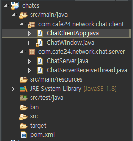
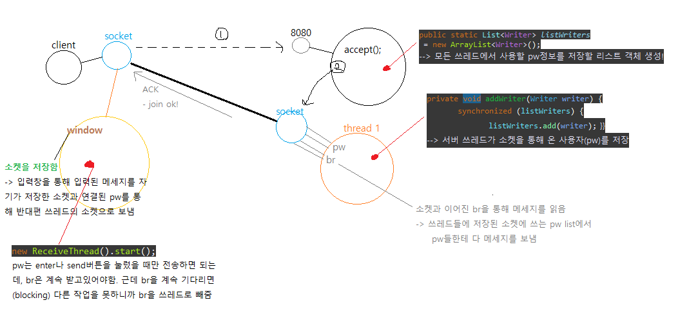
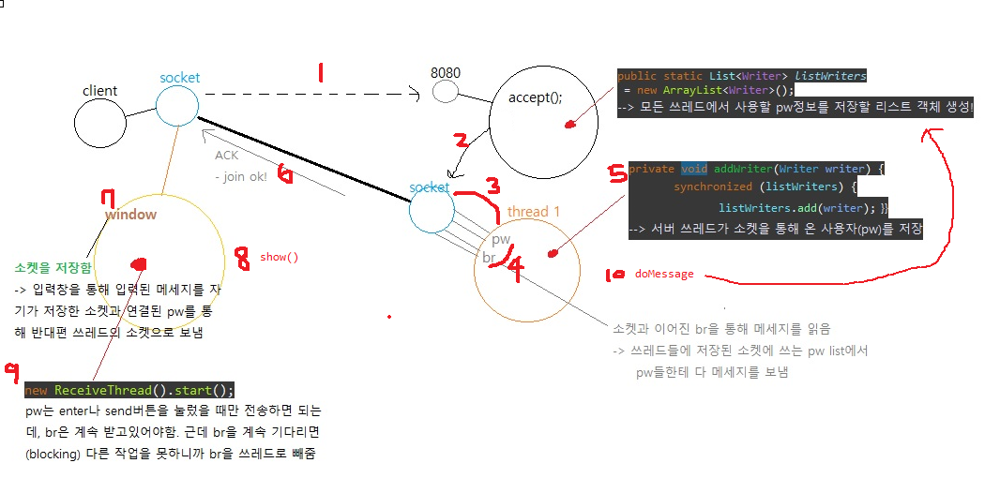

# 소켓 채팅 과정 이해 정리


**D:\cafe24 수업\강의자료\실습및과제\chat-exe**

**프로젝트 폴더 구성**

> 

> D:\dowork\Eclipse-Workspace\chatcs\target\classes
>
> > java com.cafe24.network.chat.client.ChatClientApp

---

## socket catting 과정 이해하기

## 서버 입장에서 그림

> 
>
> 




---

## 코드 따라가며 이해해보기

### 중요하다고 생각하는 메인 코드만 살펴보기





#### 1 먼저 ChatServer.java (Main Thread)를 구현한다.

**ChatServer.java**

```java
ServerSocket serverSocket = null;
serverSocket = new ServerSocket();
serverSocket.bind(new InetSocketAddress("0.0.0.0", PORT));
```

> 서버 소켓 생성

```java
Socket socket = serverSocket.accept();
```

> 클라이언트로부터 요청이 올때까지 기다림(blocking)

 ```java
public static List<Writer> listWriters = new ArrayList<Writer>();
 ```

> 모든 쓰레드에서 사용할 pw정보를 저장할 리스트 객체 생성


#### **1번과정**

**ChatClientApp.java**

```java
private static final String SERVER_IP = "192.168.1.12";
private static final int SERVER_PORT = 9999;
// 소켓 생성
Socket socket = null;
socket = new Socket();
// 서버 연결
socket.connect(new InetSocketAddress(SERVER_IP, SERVER_PORT));
// 2. iostream 구현
BufferedReader br = new BufferedReader(
    new InputStreamReader(socket.getInputStream(), "utf-8"));
PrintWriter pw = new PrintWriter(
    new OutputStreamWriter(socket.getOutputStream(), "utf-8"),true);

// 서버가 연결 된 후 !!!!!
// 3. join 프로토콜  -> 서버가 닉네임 받아서 처리 / 성공하면 다음 실행 
pw.println("join:"+ name);
String ack = br.readLine(); 
```

> 해당 ip 포트에 연결을 요청한다
>
> 연결이 될 때 까지 기다린다.


> 서버에서 2번과정을 걸쳐 연결을 한 뒤 소켓을 만들면, 
>
> 그때 name(pw)을 전송함, 그리고 서버의 응답(br)을 기다림

> 위의 `String ack = br.readLine(); ` 코드가 blocking상태임


#### 2번, 3번 과정

**ChatServer.java**

이전 코드에서 클라이언트의 요청을 기다리던

`Socket socket = serverSocket.accept();` 코드는 요청을 받을 순간 아래로 내려감

```java
Thread thread = new ChatServerReceiveThread(socket, listWriters);
thread.start();
```

> 소켓을 생성한뒤 Tread와 Socket을 연결하고, 쓰레드를 생성한다, 
>
> 이 과정을 끝내면 다시 다른 클라이언트의 요청을 기다리러 돌아간다, (While(true))


#### 4번과정

위의 `thread.start()`코드를 통해 Thread의 run()메소드가 실행된다.

**ChatServerReceiveThread.java**

```java
private Socket socket;    //소켓 객체
private String nickname;  //사용자의 닉네임
List<Writer> listWriters; // 모든 쓰레드의 pw 저장 리스트
PrintWriter pw = null;
BufferedReader br = null;
```

> 변수를 설정해준다.

```java
InetSocketAddress inetRemoteSocketAddress = (InetSocketAddress) socket.getRemoteSocketAddress();
		String remoteHostAddress = inetRemoteSocketAddress.getAddress().getHostAddress();
		int remotePort = inetRemoteSocketAddress.getPort();
```

> 소켓과 Thread의 연결!

```java
br = new BufferedReader(new InputStreamReader(socket.getInputStream(), "utf-8"));
pw = new PrintWriter(new OutputStreamWriter(socket.getOutputStream(), "utf-8"), true);
```

> br과 pw 통로를 이어 붙임

```java
String data = br.readLine();
```

> 클라이언트의 br을 기다리는 blocking 코드
>
> client쪽에서 `pw.println("join:"+ name);` 를 통해 닉네임 데이터를 전송했음
>
> 1번과정의 `pw.println("join:"+ name);`


> 아래 코드는 클라이언트(pw)가 보낸 데이터를 서버(br)에서 받고, 프로토콜을 분석하는 코드임

```java
String[] tokens = data.split(":");
if("join".equals(tokens[0])) {
    doJoin(tokens[1], pw);
}else if ("message".equals(tokens[0])) {
    if(tokens[1].isEmpty()==false) {
        doMessage(tokens[1]);
    }
}else {
    ChatServer.log("알수없는 요청");
}
```

> 먼저 클라이언트는 `"join:"+ name` 를 보냈기 떄문에 doJoin()메소드가 실행된다.


#### 5번과정

```java
private void doJoin(String nickName, Writer writer) {
    this.nickname = nickName;
    String data = nickName + "님이 참여하셨습니다.";
    broadcast(data);

    // writer pool 에 현재 스레드 printWriter를 저장
    addWriter(writer);

    // ack 보내기
    pw.println("대화에 참가하셨습니다.");
    pw.flush();
}
```

> 해당 사용자의 nickname을 설정해주고,
>
> `broadcast(date)` 메소드를 통해 다른 쓰레드에 입장 정보를 프린트한다.
>
> `addWriter(writer)` 메소드를 통해 listWriters에 사용자를 저장 
>
> ```java
> private void addWriter(Writer writer) {
>     synchronized (listWriters) {
>         listWriters.add(writer);
>     }
> }
> ```
>
> 그 후 사용자에게 연결이 되었다는 ACK 신호를 보낸다! 
>
> > A : 참여 메세지를 보낸 뒤 사용자를 추가하는 이유는?
> >
> > Q : 다른 사용자들에게만 입장 정보를 보여주고 나에겐 굳이 보여줄 필요가 없으니.


#### 6번과정

드디어 기다리던 ACK 신호가 왔다!

>  클라이언트는 `String ack = br.readLine();` --> blocking 중이였음!

>  `System.out.println("------->" + ack);` 으로 연결을 확인함

서버로 부터 ACK신호가 왔으니, 윈도우 채팅창을 열어도 되겠다!

```java
new ChatWindow(name, socket).show();
```

> 여기서 윈도우에는 나의 nickname과 socket정보를 넘긴다.


#### 7번과정

**ChatWindow.java**

```java
public ChatWindow(String name, Socket socket) {
    this.socket = socket;
    this.name = name;
    frame = new Frame(name); // 큰 틀
    pannel = new Panel(); // 아래 대화 입력
    buttonSend = new Button("Send"); // 패널의 자식
    textField = new TextField(); // 패널의 자석
    textArea = new TextArea(30, 80); // 대화 뜨는 공간
}
```

> 윈도우가 소켓을 저장함!
>
> --> 채팅 입력창을 통해 입력된 메세지를 자기가 저장한 소켓(클라이언트 소켓)과 연결된 pw(서버와 연결된 소켓)를 통해 반대편 쓰레드의 소켓으로 보냄 
>
> 
>
> 초록색 방향이라고 보면 됨!


그 다음..


#### 8번과정

**show() 메소드가 실행되며, 윈도우 창을 만든다( 윈도우 채팅창 조건 설정에 맞게 뜸! )**

- 윈도우 안의 컨트롤 위치와 크기를 잡는다!!!

가장 중요한 메세지를 보내는 두가지 방법 설정 --> send버튼 클릭, Enter키!

```java
// Button
buttonSend.setBackground(Color.GRAY);
buttonSend.setForeground(Color.WHITE);
buttonSend.addActionListener(new ActionListener() { 
    // 버튼이 눌려지는지 기다림
    @Override
    public void actionPerformed(ActionEvent actionEvent) {
        sendMessage();
    }
});

// Textfield
textField.setColumns(80);
textField.addKeyListener(new KeyAdapter() {
    // 엔터 쳤을 때
    @Override
    public void keyPressed(KeyEvent e) {
        char keyCode = e.getKeyChar();
        if (keyCode == KeyEvent.VK_ENTER) {
            sendMessage();
        }
    }
}); 
```

> 위의 두가지 행동을 하면 `sendMessage();`메소드가 실행된다. 10번과정에서 설명


#### 9번과정

★★ 가장 헷갈린 부분

개념을 먼저 알고가자.

클라이언트 입장에서는, 엔터를 칠 떄, 혹은 send 버튼을 클릭 했을 떄 메세지를 보낼 수 있다. -> 특정 행동시 pw를 보냄 -> **While을 돌릴 필요가 없음!**

> Q : 반면 클라이언트에서 서버의pw 즉 br을 받는 것은 계속해서 대기해야 한다. 
>
> A : 다른 사용자들간 몇시 몇분에 언제 채팅을 보낼 지 모름 -> 끊임없이 받아야함!

결론은, 클라이언트 입장에서 pw는 괜찮지만 br은 while문을 통해 계속해서

메세지가 올 때까지 대기(blocking)해야 한다는 말이다.

이렇게 되면 br에서 blocking이 걸리기 때문에 pw도 보낼 수 없게된다.

그러므로, br은 새로운 **!!! Thread !!!**를 통해 while문을 돌려주자!!!

쓰레드는 내부 클래스로 show()메소드에서 호출했당

```java
// Thread 생성
new ReceiveThread().start();
```

```java
private class ReceiveThread extends Thread {
    @Override
    public void run() {
        while(true){
            try {
                String reply = br.readLine(); // blocking
                if (reply == null){
                    break;
                }
                updateTextArea(reply);
            } catch (IOException e1) {
                e1.printStackTrace();
            }
        }
    }
}
```


#### 10번과정

위의 과정으로 br은 해결했다, 그럼 pw는 어떻게 보낼 것인가!!!

8번과정에서 넘어갔던 `sendMessage();`메소드를 살펴보자!

```java
private void sendMessage() {
    String message = textField.getText();

    pw.println("message:" + message);

    textField.setText("");
    textField.requestFocus();
}
```

> 사용자의 입력이 `textField`에 있으니 getText를 통해 가져오자!!
>
> 그리고? pw.println을 통해 보내주면 끝!!
>
> 다만, ui 정리를 위해 채팅입력칸을 비워주고 focus를 맞춰주자!


#### 11번 과정

10번과정에서 사용자가 pw를 보냈다 (서버입장에서는 br!)

이전 doJoin을 끝낸 뒤 다시 blocking (`String data = br.readLine();`)이 되어있던 서버는 드디어 사용자의 pw를 받게된다.

이 때 사용자는 `pw.println("message:" + message);` 로 보내기 떄문에

서버측에서 메세지로 구별 할 수 있다.

```java
// 프로토콜 분석
String[] tokens = data.split(":");
if("join".equals(tokens[0])) {
    doJoin(tokens[1], pw);
}else if ("message".equals(tokens[0])) {
    if(tokens[1].isEmpty()==false) {
        doMessage(tokens[1]);
    }
}else {
    ChatServer.log("알수없는 요청");
}
```

> 그렇다면? doMessage() 메소드를 실행할 것이다

```java
private void doMessage(String message) {
    broadcast(message);
}
```

> 여기서 중요한 점!! ★★
>
> 서버에서는 자신이 갖고있는 모든 쓰레드 즉, 모든 사용자에게 채팅 내용을 전송해야 한다. 이는 broadcast()메소드를 통해 가능하다.

```java
private void broadcast(String data) {
    synchronized (listWriters) {
        for(Writer writer : listWriters) {
            PrintWriter pw = (PrintWriter)writer;
            pw.println(nickname + " : " +data);
            pw.flush();
        }
    }
}
```

> pw리스트를 돌며 해당하는 모~~든 사용자에게 pw를 보낸다!
>
> 그렇다면 사용자 입장에서는 사용자쓰레드를 통해
>
> 계속해서 br(서버의pw)을 받으며 채팅을 찍을 수 있다.!


---

#### 채팅이 끝난 후 사용자 처리

```java
private void doQuit(Writer writer) {
    removeWriter(writer);

    String data = nickname + "님이 퇴장하셨습니다.";
    synchronized (listWriters) {
        for(Writer writer2 : listWriters) {
            PrintWriter pw = (PrintWriter)writer2;
            pw.println("---------" +data+"---------");
            pw.flush();
        }
    }
}
```


