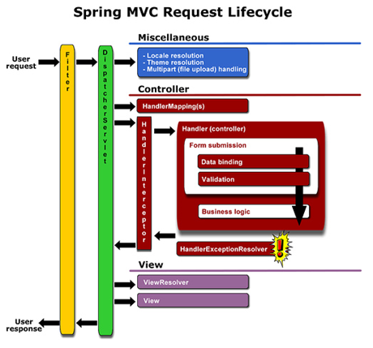
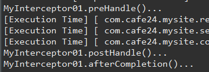
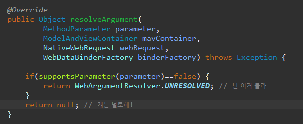
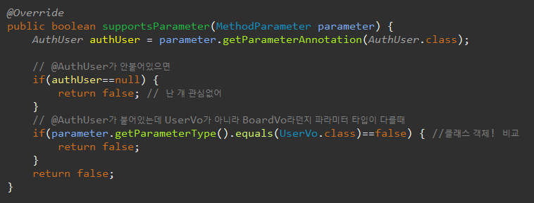
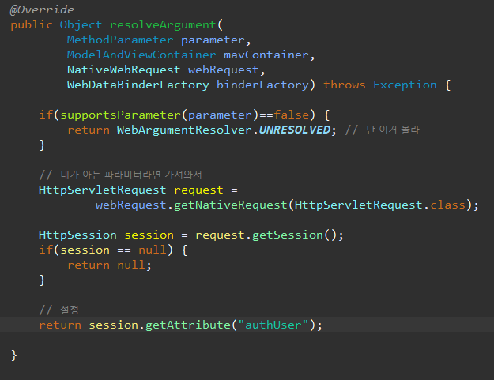

[TOC]


---

# Interceptor

- Spring에서 HTTP Request와  HTTP Response를  Controller 앞과 뒤에서 가로채는 역할을 한다. 

- Servlet의 앞과 뒤에서 HTTP Request와  HTTP Response를 가로채는 필터와 유사하다.

- Interceptor를 구현하기 위해서는 HandlerInterceptor 인터페이스를 구현하여야  한다. 



## * Filter와 Interceptor의 차이

**1. 호출 시점**

Filter는 DispatcherServlet이 실행되기 전 , Interceptor는 DispatcherServlet이 실행된 후

**2. 설정 위치**

Filter는 web.xml , Interceptor는 spring-servlet.xml

**3. 구현 방식**

Filter는 web.xml에서 설정을 하면 구현이 가능하지만, Interceptor는 설정은 물론 메서드 구현이 필요

---


---

## * 실습

### - new package 

- com.cafe24.mysite.interceptor

**MyInterceptor01.class** - implements HandlerInterceptor 

```java
package com.cafe24.mysite.interceptor;
public class MyInterceptor01 implements HandlerInterceptor {
    @Override
    public boolean preHandle(HttpServletRequest request, HttpServletResponse response, Object handler)
        throws Exception {
        System.out.println("MyInterceptor01.preHandle()...");
        return true;
    }

    @Override
    public void postHandle(HttpServletRequest request, HttpServletResponse response, Object handler,
                           ModelAndView modelAndView) throws Exception {
        System.out.println("MyInterceptor01.postHandle()...");

    }

    @Override
    public void afterCompletion(HttpServletRequest request, HttpServletResponse response, Object handler, Exception ex)
        throws Exception {
        System.out.println("MyInterceptor01.afterCompletion()...");

    }
}
```

### - 설정

**spring-servlet.xml**

```xml
<!-- Interceptors -->
<mvc:interceptors>
    <mvc:interceptor>
        <mvc:mapping path="/guestbook/**" />
        <bean class="com.cafe24.mysite.interceptor.MyInterceptor01" />
    </mvc:interceptor>
</mvc:interceptors>
```

> dispatcherServlet이 controller바로 호출하다가 이제 
>
> `/guestbook`으로 가는 모든 요청이 MyInterceptor01로 가게됨!



**MyInterceptor01**

```java
@Override
public boolean preHandle(HttpServletRequest request, HttpServletResponse response, Object handler)
    throws Exception {
    System.out.println("MyInterceptor01.preHandle()...");
    return false;
}
```

> 
>
> preHandle()만 호출!

---


---

**MyInterceptor02.java**

```java
	@Override
	public boolean preHandle(HttpServletRequest request, HttpServletResponse response, Object handler)
			throws Exception {
		System.out.println("MyInterceptor02.preHandle()...");
		return false;
	}
```

**spring-servlet.xml**

```xml
<!-- Interceptors -->
<mvc:interceptors>
    <mvc:interceptor>
        <mvc:mapping path="/guestbook/**" />
        <bean class="com.cafe24.mysite.interceptor.MyInterceptor02" />
    </mvc:interceptor>
</mvc:interceptors>
```

> 

---


---

## * login interceptor

UserController에서

`/user/login` 으로 들어오는 요청을 interceptor로 막아야함!

### - new package

- com.cafe24.security

**AuthLoginInterceptor.java**

```java
	@Autowired
	private UserService userService;
```

> 내부에서는 그냥 @Autowired

---


---

interceptor는 컨테이너 안에 있지만, 바깥에 있다고 가정하고

#### 외부에서 컨테이너 내의 객체 가져오는 방법은!?

tomcat에게 Application Context는 servlet이고,

spring에게 Application Context는 bean들임 -> 톰캣의 ApplicationContext안에 저장되어있다구

그래서 톰캣의 `WebApplicationContextUtils`안에서  컨테이너를 가져오면 돼

근데 어떤 컨테이너가 있는지 컨테이너 이름을 모르잖아 `request.getServletContext()` 로 가져오면 돼

**AuthLoginInterceptor.java**

```java
// 외부에서 컨테이너 내의 객체 가져오는 방법은!?
ApplicationContext ac = 
    WebApplicationContextUtils.getWebApplicationContext(
    request.getServletContext()
);
```

> ServletContext:
>
> 하나의 서블릿이 서블릿 컨테이너와 통신하기 위해서 사용되어지는 메서드들을 가지고 있는 클래스

---

> ContextLoaderListener는 로딩할 /WEB-INF/applicationContext.xml 파일을 찾을 것이다. 컨텐스트 파일이 로딩되고 나면 빈 정의에 기반해서 [WebApplicationContext](http://static.springframework.org/spring/docs/3.0.x/javadoc-api/org/springframework/web/context/WebApplicationContext.html)객체를 생성하고 웹 어플리케이션의 ServletContext에 저장한다.
>
> 모든 자바 웹 어플리케이션은 서블릿 API를 기반으로 만들어졌다. 그래서 ContextLoaderListener가 생성한 이 '비즈니스 컨텍스트' ApplicationContext에 접근하는 코드
>
> `WebApplicationContextUtils.getWebApplicationContext(request.getServletContext());`

---

```java
package com.cafe24.security;

import javax.servlet.http.HttpServletRequest;
import javax.servlet.http.HttpServletResponse;
import javax.servlet.http.HttpSession;

import org.springframework.context.ApplicationContext;
import org.springframework.web.context.support.WebApplicationContextUtils;
import org.springframework.web.servlet.handler.HandlerInterceptorAdapter;

import com.cafe24.mysite.service.UserService;
import com.cafe24.mysite.vo.UserVo;

public class AuthLoginInterceptor extends HandlerInterceptorAdapter {
    @Override
    public boolean preHandle(HttpServletRequest request, HttpServletResponse response, Object handler)
        throws Exception {

        String email = request.getParameter("email");
        String password = request.getParameter("password");

        // 외부에서 컨테이너 내의 객체 가져오는 방법은!?
        ApplicationContext ac = 
            WebApplicationContextUtils.getWebApplicationContext(
            request.getServletContext()
        );

        UserService userService = ac.getBean(UserService.class);

        UserVo userVo = new UserVo();
        userVo.setEmail(email);
        userVo.setPassword(password);
        UserVo authUser = userService.getUser(userVo);
        if(authUser==null) {
            response.sendRedirect(request.getContextPath()+"/user/login");
            return false;
        }

        // session 처리
        HttpSession session = request.getSession(true);
        session.setAttribute("authUser", authUser);
        response.sendRedirect(request.getContextPath());

        return false;
    }
}
```

**spring-servlet.xml**

```xml
<!-- Interceptors -->
<mvc:interceptors>
    </mvc:interceptor> -->
<mvc:interceptor>
    <mvc:mapping path="/user/auth" />
    <bean class="com.cafe24.security.AuthLoginInterceptor" />
</mvc:interceptor>
</mvc:interceptors> 
```

**login.jsp**

```jsp
<form id="login-form" name="loginform" method="post"
      action="${pageContext.servletContext.contextPath}/user/auth">
```

근데~ 우린 지금 Autowired가능하잖아~~

```java
package com.cafe24.security;

public class AuthLoginInterceptor extends HandlerInterceptorAdapter {

	@Autowired
	private UserService userService;
	
	@Override
	public boolean preHandle(HttpServletRequest request, HttpServletResponse response, Object handler)
			throws Exception {
		
		String email = request.getParameter("email");
		String password = request.getParameter("password");

		UserVo userVo = new UserVo();
		userVo.setEmail(email);
		userVo.setPassword(password);
		UserVo authUser = userService.getUser(userVo);
		if(authUser==null) {
			response.sendRedirect(request.getContextPath()+"/user/login");
			return false;
		}
		
		// session 처리
		HttpSession session = request.getSession(true);
		session.setAttribute("authUser", authUser);
		response.sendRedirect(request.getContextPath());
		
		return false;
	}
}
```

**UserController.java**

login로직 지워도됨


---


---

## * Logout Interceptor

**AuthLogoutInterceptor.java**

```java
package com.cafe24.security;
public class AuthLogoutInterceptor extends HandlerInterceptorAdapter {

	@Override
	public boolean preHandle(HttpServletRequest request, HttpServletResponse response, Object handler)
			throws Exception {
		HttpSession session = request.getSession();
		
		session.removeAttribute("authUser");
		session.invalidate();
		response.sendRedirect(request.getContextPath());
		return false;
	}
}
```

**Controller에서 logout 메소드 지우기**

**spring-servlet.xml**

```xml
<!-- Interceptors -->
<mvc:interceptors>
    <mvc:interceptor>
        <mvc:mapping path="/user/auth" />
        <bean class="com.cafe24.security.AuthLoginInterceptor" />
    </mvc:interceptor>
    <mvc:interceptor>
        <mvc:mapping path="/user/logout" />
        <bean class="com.cafe24.security.AuthLogoutInterceptor" />
    </mvc:interceptor>
</mvc:interceptors> 
```

---


---

## * WriteInterceptor -  `@Auth`

**로그인 해야지만 글쓰기 가능하게 할때**

**BoardController.java**

```java
@RequestMapping(value = "/write", method = RequestMethod.GET)
public String write(@ModelAttribute BoardVo boardVo,
                    @ModelAttribute("fCri") FindCriteria fCri,
                    HttpSession session) {
    if(session.getAttribute("authUser")==null) {
        return "redirect:/";
    }
    return "board/write";
}
```

---


**어노테이션 공부하고 다시 돌아오자!~**


---

# Annotation

>  해당 경로로 들어오면 controller의 그 메소드가 실행되는데
>
> 그전에 어노테이션을 보고 인터프리터로 보내는데
>
> 인터프리터에서 return true면 상관없이 컨트롤러 메소드 바로 실행하고,
>
> return fasle면 controller의 메소드가 실행이 안됨

> 인터프리터에서 어노테이션을 검사할때, handler의종류가 
>
> `handler instanceof HandlerMethod == false`가 아니면 
>
> 즉! default servlet handler면! return true해줘야해 -> 우리가 직접 `requestMapping`하지 않은 이미지 파일 같은거


**com.cafe24.security/Auth.java**

```java
@Target(ElementType.METHOD) 
// 이 어노테이션 어디에 붙여쓸거야? 파라미터? 메소드?
@Retention(RetentionPolicy.RUNTIME)
public @interface Auth {
    String value() default "USER";
	int test() default 1;
}
```

AdminController 에서 관리자로 관리한다고 칠때, 메소드에 일일이 `@Auth`붙이는거보다, class에 한번에 어노테이션 붙이는게 낫자나? 

메소드, 클래스에 붙이고 싶으면

`@Target({ElementType.TYPE, ElementType.METHOD}) `

**AdminController.java**

```java
package com.cafe24.mysite.controller;
@Auth(value="ADMIN", test=1)
public class AdminController {
	public String site() {
		return "";
	}
	public String user() {
		return "";
	}
}
```

이런식으로 사용할 수 있음

---

## enum

**Auth.java**  -> 그냥 와꾸만 만들고 AuthInterceptor에서 구현함

```java
	public enum Role{USER, ADMIN}
	public Role role() default Role.USER;
```

**AdminController.java**

```java
@Auth(role=Auth.Role.ADMIN)
```


**BoardController.java**

```java
@Auth(role=Auth.Role.ADMIN)
@RequestMapping(value = "/write", method = RequestMethod.GET)
public String write(@ModelAttribute BoardVo boardVo,
                    @ModelAttribute("fCri") FindCriteria fCri
						/*HttpSession session*/) {
//		if(session.getAttribute("authUser")==null) {
//			return "redirect:/";
//		}
		return "board/write";
	}
```


**spring-servlet.xml** 추가

```xml
<mvc:interceptor>
    <mvc:mapping path="/**" />
    <mvc:exclude-mapping path="/user/auth"/>
    <mvc:exclude-mapping path="/user/logout"/>
    <mvc:exclude-mapping path="/assets/**"/>
    <bean class="com.cafe24.security.AuthInterceptor" />
</mvc:interceptor>
```

>    <mvc:exclude-mapping path="/user/auth"/>
>    <mvc:exclude-mapping path="/user/logout"/>
>    <mvc:exclude-mapping path="/assets/**"/>
>쟤네는 빼고 모두 다 `com.cafe24.security.AuthIntercepto`r 여기로 보내


com.cafe24.security/ **AuthInterceptor.java**

```java
package com.cafe24.security;
public class AuthInterceptor extends HandlerInterceptorAdapter {

	@Override
	public boolean preHandle(HttpServletRequest request, HttpServletResponse response, Object handler)
			throws Exception {
//System.out.println(handler+"@@@");
// 기본:  public java.lang.String com.cafe24.mysite.controller.MainController.main(org.springframework.web.servlet.ModelAndView)
// 이미지 : org.springframework.web.servlet.resource.DefaultServletHttpRequestHandler@9a1f68a
		
        
		// 1. handler 종류 확인
		if (handler instanceof HandlerMethod == false) {
			return true;
		} // -> 매핑 정보가 없으면(image파일이라던지) true ->인터셉터 타지마
		
		// 2. casting
		HandlerMethod handlerMethod = (HandlerMethod)handler;
		
		// 3. Method의 @Auth받아오기
		Auth auth = handlerMethod.getMethodAnnotation(Auth.class);
		
		// 4. Method @Auth 없으면
		//    class(Type)에 @Auth받아오기
//		if(auth == null) {
//			auth = ... 과제!
//		}
		
		// 5. @Auth가 안 붙어있는 경우
		if(auth == null) {
			return true;
		}
		
		// 6. @Auth가 (class 또는 method에) 붙어있기 때문에
		//    인증여부 체크!
		HttpSession session = request.getSession();
		
		if(session == null) { // 인증 안되어있으면
			response.sendRedirect(request.getContextPath()+"/user/login");
			return false;
		}
		
		// 7. 인증되어있으면 AuthUser 가져오기
		UserVo authUser = (UserVo) session.getAttribute("authUser");
		if(authUser==null) { // 인증 안되어있으면
			response.sendRedirect(request.getContextPath()+"/user/login");
			return false;		
		}
		
		// 8. Role 가져오기
		Auth.Role role = auth.role();
		
		// 9. role이 Auth.Role.User 라면, 
		//  BoardController에 @Auth(role=Auth.Role.USER) 라면! 관리자도, 유저도 들어갈 수 있어야함
		//  인증된 모든 사용자는 접근 가능 
		if(role==Auth.Role.USER) {
			return true;
		}
		
		// 10. Admin Role 권한 체크 
		//     authUser.getRole().equals("ADMIN")  - 과제
		return true;
	}
}
```

**BoardController.java 기존코드**

```java
@Auth(role=Auth.Role.USER)
@RequestMapping(value = "/write", method = RequestMethod.GET)
public String write(@ModelAttribute BoardVo boardVo,
                    @ModelAttribute("fCri") FindCriteria fCri,
						HttpSession session) {
		if(session.getAttribute("authUser")==null) {
			return "redirect:/";
		}
		return "board/write";
	}
```

**BoardController.java 바뀐코드**

```java
@Auth
@RequestMapping(value = "/write", method = RequestMethod.GET)
public String write(@ModelAttribute BoardVo boardVo,
                    @ModelAttribute("fCri") FindCriteria fCri) {
		return "board/write";
	}
```

---


---

## HttpSession session분리

### /user/update

**UserController.java 기존코드**

```java
@RequestMapping(value = "/update", method = RequestMethod.GET)
public String update(HttpSession session, Model model) {
    UserVo authUser = (UserVo) session.getAttribute("authUser");
    if (authUser == null) {
        return "redirect:/";
    }

    UserVo userVo = userService.getUser(authUser.getNo());
    model.addAttribute("userVo", userVo);
    return "user/update";
}
```

**UserController.java 바뀐코드**

```java
@Auth
@RequestMapping(value = "/update", method = RequestMethod.GET)
public String update(
    @AuthUser UserVo authUser, 
    Model model) {
    UserVo userVo = userService.getUser(authUser.getNo());
    model.addAttribute("userVo", userVo);
    return "user/update";
}
```


com.cafe24.security/**AuthUser.java**

```java
@Retention(RetentionPolicy.RUNTIME)
@Target(ElementType.PARAMETER)
public @interface AuthUser {

}

```

---


---

### **AuthUserHandlerMethodArgumentResolver**

**com.cafe24.security/AuthUserHandlerMethodArgumentResolver.java**

> @AuthUser 관한 class



**어노테이션의 파라미터 검사**



**파라미터 검사를 했으면**



---

### spring-servlet.xml

`<mvc:annotation-driven> </mvc:annotation-driven> ` 사이에 추가

```xml
<!-- Argument Resolver -->
<mvc:argument-resolvers>
    <bean class="com.cafe.security.AuthUserHandlerMethodArgumentResolver"/>
</mvc:argument-resolvers>
```


