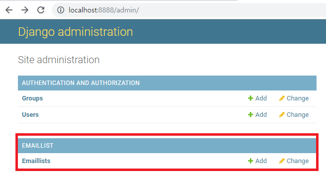
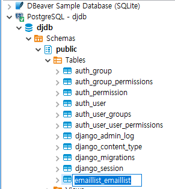
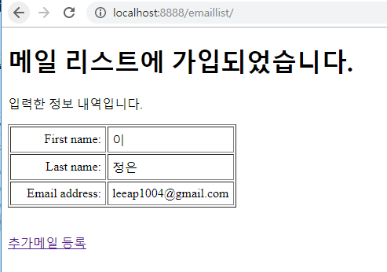
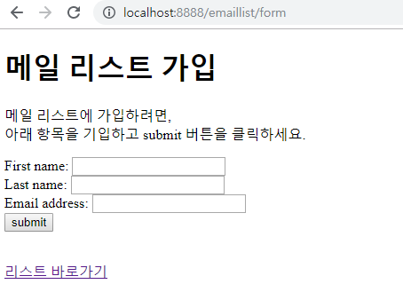

[TOC]

---

[전체 코드 보기](https://github.com/jungeunlee95/django-basic)

---

# [django] 3 Python Django - Application 추가 작업 

[지난 포스팅](https://jungeunlee95.github.io/django/2019/06/19/1-Django-postgrsql-연동-시작하기/)에 이어서, 오늘은 Application 추가 작업을 공부할 것이다.


**Application 기본 작업 순서**

```
기본적으로 장고 프로젝트 한 개당 한 개의 DB를 사용한다.
Application 작업 순서
	1. 어플리케이션 추가
        [터미널]
        python manage.py startapp 앱이름
        
	2. 어플리커이션 등록 (settings.py)
        INSTALLED_APPS = [
               '앱이름',
                ...,
        ]
        
    3. template
    	|--- 앱이름
    	어플리케이션 template 디렉토리 생성
    	
   	4-1. Model 정의 (db:postgresql 사용)
   	4-2. admin.py에 모듈 추가
   	4-3. migrations 이름의 DDL python 모듈 생성
   	4-4. 물리DB와 스키마 동기화 작업
   	
   	5. urls.py에서 url-view의 handler 매핑
   	
   	6. views.py에서 핸들러 함수 구현(요청처리, 모델작업)
   	
   	7. 화면이 필요한 경우, 해당 template 작업
```

---

---

## 1. emaillist app 추가

`python manage.py startapp emaillist`


## 2. python settings.py APP 추가

```python
INSTALLED_APPS = [
    'emaillist',
    'helloworld',
    'django.contrib.admin',
    'django.contrib.auth',
    'django.contrib.contenttypes',
    'django.contrib.sessions',
    'django.contrib.messages',
    'django.contrib.staticfiles',
]
```


## 3. emaillist template 디렉토리 추가


## 4-1. 모델 정의

**emaillist/models.py**

모든 Model은 `models.Model`을 상속받아야 한다.

```python
from django.db import models

class Emaillist(models.Model):
    first_name = models.CharField(max_length=50)
    last_name = models.CharField(max_length=100)
    email = models.CharField(max_length=200)

    def __str__(self):
        return f'Emaillist({self.first_name}, {self.last_name}, {self.email})'
```


## 4-2. admin.py에 모듈 추가

**emaillist/admin.py**

```python
from django.contrib import admin
from emaillist.models import Emaillist

admin.site.register(Emaillist)
```

> admin 페이지에서 관리 가능




## 4-3. migrations 이름의 DDL python 모듈 생성

terminal : `python manage.py makemigrations` 

```shell
(venv) D:\dowork\PycharmProjects\python_ch3>python manage.py makemigrations

Migrations for 'emaillist':
  emaillist\migrations\0001_initial.py
    - Create model Emaillist
```

> **emaillist/migrations/** 디렉토리 밑에 DDL 정보가 담겨있는 파일이 생성된다.


## 4-4. 물리DB와 스키마 동기화 작업

terminal : `python manage.py migrate` 

```
(venv) D:\dowork\PycharmProjects\python_ch3>python manage.py migrate

Operations to perform:
  Apply all migrations: admin, auth, contenttypes, emaillist, sessions
Running migrations:
  Applying emaillist.0001_initial... OK
```

**DBeaver를 통해 데이터 베이스 확인해보기**

> 
>
> application이름_table이름


## 5. urls.py에서 url-view의 handler 매핑등록

**python_ch3/urls.py**

```python
import emaillist.views as emaillist_views
import helloworld.views as helloworld_views

urlpatterns = [
    path('emaillist/', emaillist_views.index),
    path('emaillist/form', emaillist_views.form),

    path('helloworld/', helloworld_views.hello),

    path('admin/', admin.site.urls),
]
```


## 6. views.py에서 핸들러 함수 구현

**emaillist/views.py**

```python
from django.shortcuts import render

def index(request):
    return render(request, 'emaillist/index.html')

def form(request):
    return render(request, 'emaillist/form.html')
```


## 7. 해당 template 작업


**index.html**

```html
<!DOCTYPE html>
<html>
<head>
<meta http-equiv="Content-Type" content="text/html; charset=UTF-8">
<title>Insert title here</title>
</head>
<body>
	<h1>메일 리스트에 가입되었습니다.</h1>
	<p>입력한 정보 내역입니다.</p>
	<!-- 메일정보 리스트 -->
	<table border="1" cellpadding="5" cellspacing="2">
		<tr>
			<td align=right>First name: </td>
			<td>이</td>
		</tr>
		<tr>
			<td align=right width="110">Last name: </td>
			<td width="110">정은</td>
		</tr>
		<tr>
			<td align=right>Email address: </td>
			<td>leeap1004@gmail.com</td>
		</tr>
	</table>
	<br>
	<p>
		<a href="/emaillist/form">추가메일 등록</a>
	</p>
	<br>
</body>
</html>
```

**form.html**

```html
<!DOCTYPE html>
<html>
<head>
<meta http-equiv="Content-Type" content="text/html; charset=UTF-8">
<title>Insert title here</title>
</head>
<body>
	<h1>메일 리스트 가입</h1>
	<p>
		메일 리스트에 가입하려면,<br>
		아래 항목을 기입하고 submit 버튼을 클릭하세요.
	</p>
	<form action="" method="">
	    First name: <input type="text" name="fn" value="" ><br>
	    Last name: <input type="text" name="ln" value=""><br>
	    Email address: <input type="text" name="email" value=""><br>
	    <input type="submit" value="submit">
	</form>
	<br>
	<p>
		<a href="/emaillist">리스트 바로가기</a>
	</p>
</body>
</html>
```


## 8. server띄워서 확인

terminal : `python manage.py runserver 0.0.0.0:8888`

> 

>


