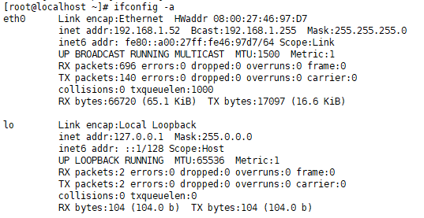
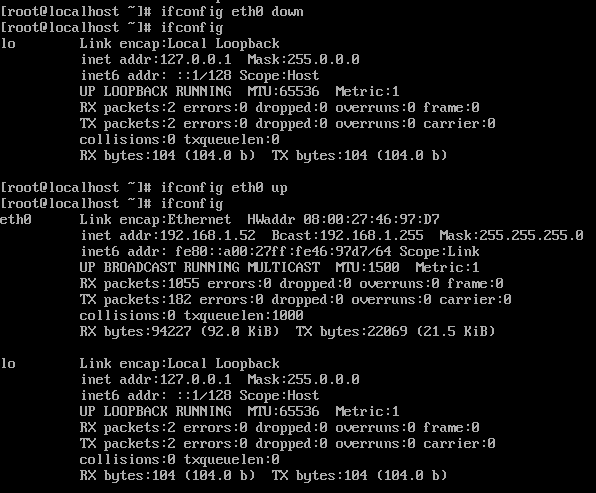
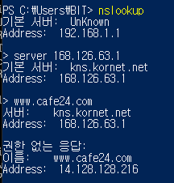
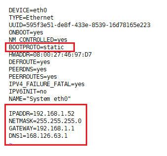
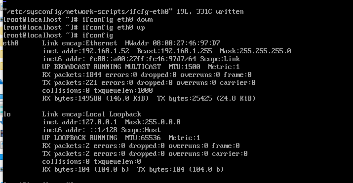
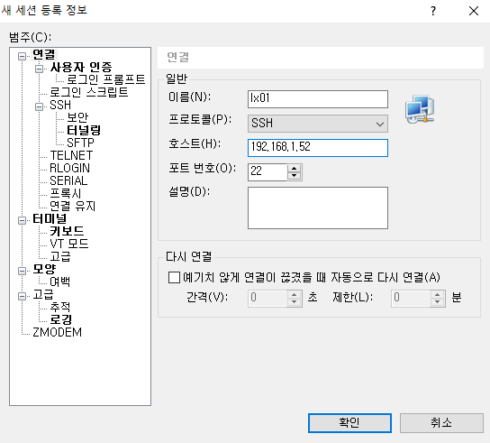

### 네트워크 설정 

#### < 네트워크관리 ppt - 33 >

내 ip 확인 

`ifconfig -a` 

> 
>
> > lo(loopback) - 나한테 돌아오는 ip = 127.0.0.1
>
> > ip address = 192.168.1.52

`if config eth0 down` : 내려보기

`if config eth0 up` : 올리기

> 

---

---

### 네트워크 설정 전 알아야 할 것

#### 1.  IPADDR = 192.168.1.52

#### 2. NETMASK = 255.255.255.0 

#### 3. GATEWAY = 192.168.1.1              -> 쓰고있는 인터넷 ( 공유기 )

#### 4. DNS1 = 168.126.63.1

> 
>
> Address 가 DNS 서버임
>
> **서버 바꿔보기**
>
> 1  `nslookup`
>
> 2 `server {바꿀ip}`
>
> 

---

---

### 네트워크 설정 - ip 고정

**서버를 restart하는 방법 3가지**

1. `ifconfig eth0 down`

   ifconfig eth0 up`

2. `/etc/init.d/network restart`

3. `sync`

   `sync`

   `sync`

   `reboot`

   

**1. 네트워크 설정 파일 수정하기**

`vi /etc/sysconfig/network-script/ifcfg-eth0`

> 

**2. 서버 restart**

> 
>
> : ip 고정!

> hosts 고정ip 했던 메모장도 수정해야함

**3. shell 설정**

새로만들기 Alt + N

> 
>
> 

