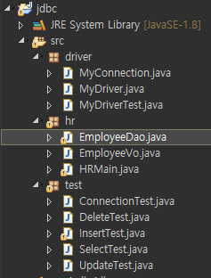
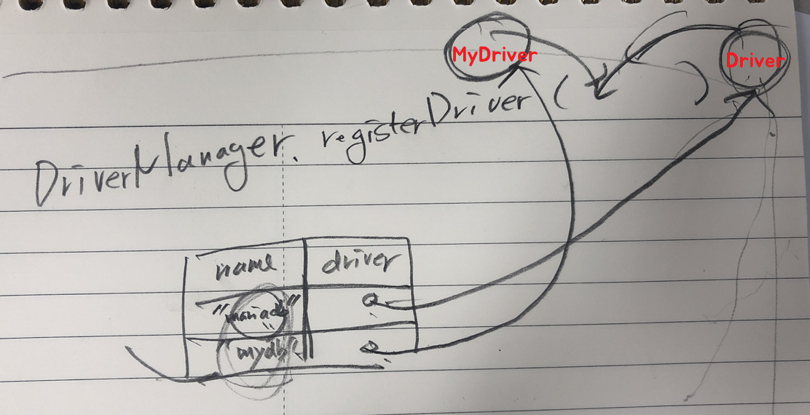
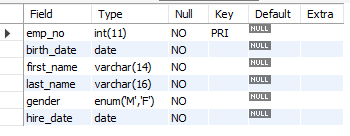

[TOC]

---

# DAO

> App과 DB 중간에서 `CRUD` 기능만 하는 객체!

- DAO를 분리하고, 데이터를 주고 받을때도 VO 객체로 주고 받음 !!!! 

- 하나의 Dao 클래스는 하나의 테이블과 연결 -> join일 경우 주테이블을 잘 찾아야함

  - ex) EmployeeDao <--> employee table

    ​      DepartmentDao <--> department table

> main(){} 에서 
>
> `Student dao = new Student()` 명령어를 실행하는 순간
>
> method area에 class가 Student로드되고 
>
> Student의 변수들과 메소드 코드들이 읽힘 

---

### [ 프로젝트 구조 ]

> 

---


## Driver

**src/driver/MyDriver.java**   -> Driver interface

```java
package driver;

public class MyDriver implements Driver {
	static {
		try {
			
			System.out.println("static code area");
			DriverManager.registerDriver( new MyDriver() ); //driver 등록
			
		} catch (SQLException e) {
			e.printStackTrace();
		}
	}

	
	@Override
	public Connection connect(String url, Properties info) throws SQLException {
		System.out.println("url : " + url);
		System.out.println("info : " + info);
		return null;
	}

...
...
```

**src/driver/MyDriverTest.java** 

```java
package driver;
public class MyDriverTest {

	public static void main(String[] args) {

		Connection conn = null;

		try {
			// 1. JDBC Driver(MariaDB) 로딩
			Class.forName("driver.MyDriver");

			// 2. 연결하기
			String url = "jdbc:mydb://192.168.1.52:3307/webdb";
			conn = DriverManager.getConnection(url, "webdb", "webdb");
					// -> MyDriver.connect()로 감
			System.out.println("연결 성공!!!!");

		} catch (ClassNotFoundException e) {
			System.out.println("Fail To Driver Loading : " + e);
		} catch (SQLException e) {
			System.out.println("Error : " + e);
		} finally {
			try {
				if (conn != null) {
					conn.close();
				}
			} catch (SQLException e) {
				e.printStackTrace();
			}
		}
	}
}
```

> ```출력
> static code area
> url : jdbc:mydb://192.168.1.52:3307/webdb
> info : {user=webdb, password=webdb}
> Error : java.sql.SQLException: No suitable driver found for jdbc:mydb://192.168.1.52:3307/webdb
> ```

> ```java
> // 2. 연결하기
> String url = "jdbc:mydb://192.168.1.52:3307/webdb";
> conn = DriverManager.getConnection(url, "webdb", "webdb");
> // -> MyDriver.connect()로 감
> System.out.println("연결 성공!!!!");
> ```


> "jdbc:**mydb**://192.168.1.52:3307/webdb";
>
> 여기서 아깐 mariadb, 지금은 mydb.. 이 이름은 아무렇게나 해도 상관없는가?
>
> --> 사용자 임의로 설정할 수 있지만, 전에 사용하던 이름은 안됨 : 중복되니까
>
> 이게 어떤형식으로 되어있냐면 ↓↓↓↓↓↓↓↓↓↓↓↓↓↓↓↓↓↓↓↓↓
>
> static으로 mydb라는 이름으로 driver와 map형식으로 묶여있음
>
> 
>
> 만약 전에 사용하던 이름으로 다시 쓰고 싶으면
>
> JVM위에 static으로 이미 설정이 되어있으니까, eclipse 껐다 키면 됨

> mydb <-> MyDriver
>
> mariadb <->Driver 
>
> 이렇게 연결됨 


**src/driver/MyConnectionjava**   --  Connection interface  만들기


**src/driver/MyDriver.java**

```java
@Override
public Connection connect(String url, Properties info) throws SQLException {
    System.out.println("url : " + url);
    System.out.println("info : " + info);
    return new MyConnection();
}
```

> ```출력
> static code area
> url : jdbc:mydb://192.168.1.52:3307/webdb
> info : {user=webdb, password=webdb}
> 연결 성공!!!!driver.MyConnection@4554617c
> ```

---


---


**hr db와 연결**

---

## HRMain

> 아래 코드와 같이 키워드로 검색해보자
>
> ```mysql
> select emp_no, first_name, last_name, hire_date
> from employees
> where first_name like '%a'
>    or last_name like '%a';
> ```

---


---

### - VO




**hr/EmployeeVo.java**

```java
package hr;

public class EmployeeVo {
	private Long no;
	private String birthDate;
	private String firstName;
	private String lastName;
	private String gender;
	private String hireDate;
	
	public Long getNo() {
		return no;
	}
	public void setNo(Long no) {
		this.no = no;
	}
	public String getBirthDate() {
		return birthDate;
	}
	public void setBirthDate(String birthDate) {
		this.birthDate = birthDate;
	}
	public String getFirstName() {
		return firstName;
	}
	public void setFirstName(String firstName) {
		this.firstName = firstName;
	}
	public String getLastName() {
		return lastName;
	}
	public void setLastName(String lastName) {
		this.lastName = lastName;
	}
	public String getGender() {
		return gender;
	}
	public void setGender(String gender) {
		this.gender = gender;
	}
	public String getHireDate() {
		return hireDate;
	}
	public void setHireDate(String hireDate) {
		this.hireDate = hireDate;
	}
	@Override
	public String toString() {
		return "EmployeeVo [no=" + no + ", birthDate=" + birthDate + ", firstName=" + firstName + ", lastName="
				+ lastName + ", gender=" + gender + ", hireDate=" + hireDate + "]";
	}
}
```

> getter/setter/toString 만들기

---

### - DAO

**hr/EmployeeDao.java**

```java
package hr;

public class EmployeeDao {

	public List<EmployeeVo> getList(String keyword) {
		List<EmployeeVo> result = new ArrayList<EmployeeVo>();
		// 자원정리
		Connection conn = null;
		Statement stmt = null;
		ResultSet rs = null;

		try {
			// 1. JDBC Driver(MariaDB) 로딩
			Class.forName("org.mariadb.jdbc.Driver");

			// 2. 연결하기
			String url = "jdbc:mariadb://192.168.1.52:3307/employees";
			conn = DriverManager.getConnection(url, "hr", "hr");

			// 3. statement 객체 생성
			stmt = conn.createStatement();

			// 4. SQL문 실행
			String sql = "  select emp_no, first_name, last_name, hire_date " + 
							" from employees " + 
							" where first_name like '%"+ keyword +"' " + 
							"   or last_name like '%"+ keyword +"' ";
			rs = stmt.executeQuery(sql);

			// 5. 결과 가져오기
			// rs는 처음에 비어있음, rs.next()가 첫번째 값을 가리킴
			while (rs.next()) {
				Long no = rs.getLong(1); // 기본 타입보다 wrapper로 묶는게 좋음
				String firstName = rs.getString(2);
				String lastName = rs.getString(3);
				String hireDate = rs.getString(4);
				
				EmployeeVo vo = new EmployeeVo();
				vo.setNo(no);
				vo.setFirstName(firstName);
				vo.setLastName(lastName);
				vo.setHireDate(hireDate);
			
				result.add(vo);
			}
		} catch (ClassNotFoundException e) {
			System.out.println("Fail To Driver Loading : " + e);
		} catch (SQLException e) {
			System.out.println("Error : " + e);
		} finally {
			try {
				if (rs != null) {
					rs.close();
				}
				if (stmt != null) {
					stmt.close();
				}
				if (conn != null) {
					conn.close();
				}
			} catch (SQLException e) {
				e.printStackTrace();
			}
		}
		return result;
	}
}
```


**hr/HRMain.java**

```java
package hr;

import java.util.List;
import java.util.Scanner;

public class HRMain {

	public static void main(String[] args) {
		
		Scanner scanner = new Scanner(System.in);
		System.out.print("검색어 > ");
		
		String keyword = scanner.nextLine();
		
		EmployeeDao dao = new EmployeeDao();
		List<EmployeeVo> list = dao.getList(keyword);
		
		for(EmployeeVo vo : list) {
			System.out.println(vo.getNo() + " : " + vo.getFirstName() + ' ' + vo.getLastName());
		}

	}

}

```

---


**Statement는 sql문이 복잡한데 엎친데 덮친격으로다가**

**sql문으로 장난질(sql injection)하는 사람이 있는데,**

**이를 방지하기 위해서 PreparedStatement**


---

## PreparedStatement

**hr/EmployeeDao.java**

```java
// 1. JDBC Driver(MariaDB) 로딩
Class.forName("org.mariadb.jdbc.Driver");

// 2. 연결하기
String url = "jdbc:mariadb://192.168.1.52:3307/employees";
conn = DriverManager.getConnection(url, "hr", "hr");

// 3. SQL문 준비
String sql = "  select emp_no, first_name, last_name, hire_date " + 
    " from employees " + 
    " where first_name like ? " + 
    "   or last_name like ? ";

pstmt = conn.prepareStatement(sql);
// 4. 바인딩
pstmt.setString(1, "%" + keyword + "%");
pstmt.setString(2, "%" + keyword + "%");

// 5. 쿼리실행
rs = pstmt.executeQuery();

// 6. 결과 가져오기
// rs는 처음에 비어있음, rs.next()가 첫번째 값을 가리킴
while (rs.next()) {
    Long no = rs.getLong(1); // 기본 타입보다 wrapper로 묶는게 좋음
    String firstName = rs.getString(2);
    String lastName = rs.getString(3);
    String hireDate = rs.getString(4);

    EmployeeVo vo = new EmployeeVo();
    vo.setNo(no);
    vo.setFirstName(firstName);
    vo.setLastName(lastName);
    vo.setHireDate(hireDate);

    result.add(vo);

}
```


