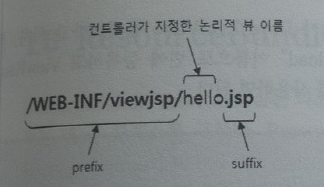

[TOC]


---

# ViewResolver 설정

**spring-servlet.xml**

```XML
<!-- 3. ViewResolver 설정  -->
<bean id="viewResolver" class="org.springframework.web.servlet.view.InternalResourceViewResolver">
    <property name="viewClass" value="org.springframework.web.servlet.view.JstlView" />
    <property name="prefix" value="/WEB-INF/views/" />
    <property name="suffix" value=".jsp" />
</bean>
```

> 이는 ViewResolver가 "/WEB-INF/views/뷰이름.jsp"를 뷰 JSP로 사용한다는 것을 의미
>
> 

**MainController.java**

```java
@Controller
public class MainController {
	@RequestMapping({"/", "/main"})
	public String main() {
		return "main/index";
	} 
}
```

> 즉, 앞의 예에서 MainController는 뷰 이름으로 "main/index"를 리턴하므로, 실제로 사용되는 뷰 파일은 "WEB-INF/views/main/index.jsp"파일이 된다.

